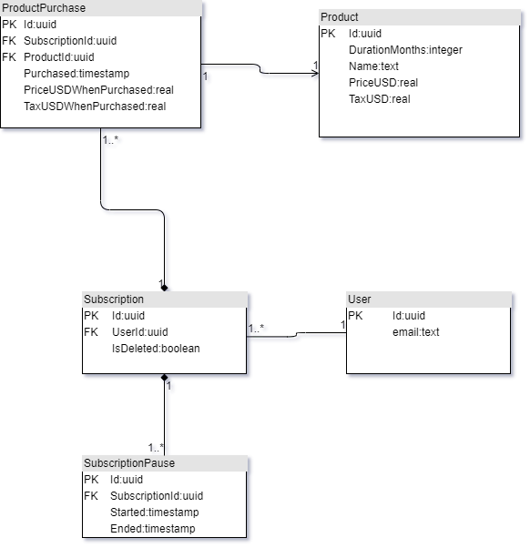

# Backendmondo Subscription API

### A simple API for browsing products and managing subscriptions.

This project was created as part of an application to the role of Backend Developer at Gymondo.

At time of writing, I believe that all acceptance criteria of the first user story have been met.

## Table of Contents

1. [How To Use](#how-to-use)
2. [Decisions & Assumptions](#decisions--assumptions)
    * [Implementation Language](#implementation-language)
    * [Hosting Solution](#hosting-solution)
    * [Assumptions](#assumptions)
3. [Known Issues](#known-issues)

## How to Use

The API is currently hosted at [https://backendmondo.herokuapp.com].

Note: as the application is running on a free Heroku instance, it may take some time for the first requests to resolve as the application spins up.

Documentation can be located [here](https://app.swaggerhub.com/apis-docs/DanMcElroy/Backendmondo), where you can also test the various endpoints exposed by the API.

This documentation should provide a description of all API endpoints, how to use them and what response data to expect.

## Decisions & Assumptions

### Implementation Language

I chose to implement this API using C# via .NET Core Web API, as it is one of the languages most familiar to me and allowed me to spin up a basic API project in a short amount of time, with a relatively small amount of code and external dependencies.

Database communication is facilitated via Entity Framework Core, an ORM framework that requires little setup and so again was ideal for a short-term project with a very simple database structure.

### Hosting Solution

The project is hosted as a Docker instance on the Heroku platform, deployed on every push to select branches via GitHub Actions.

The application was developed as a Docker-based microservice, after some initial setup work, it makes continuous integration and deployment incredibly simple, and allowed me to spend the majority of development time focusing on meeting the acceptance criteria. 
Also, in a hypothetical scenario where this API is used in a production system, building the application as a microservice allows for a high degree of flexibility in scale, deployment platforms, and so on.

Heroku was chosen as a platform primarily for its ease-of-use in getting started and configuration, while offering good logging/continuous deployment solutions. The database is also hosted in Heroku Postgres, which again 
simplified the hosting and deployment processes and allowed me to focus on tackling the core of the task.

### Assumptions

1. When the user requests information about their subscription, the "duration" mentioned in the acceptance criteria refers to the full purchased duration of the subscription and does not refer to remaining time, or consider the extensions from pausing a subscription (see below).
2. When a subscription is paused, that will in effect extend the end date of the initial subscription - so for example, if I buy a 12-month subscription in March 2020 and pause the subscription for 1 month between August and September, the end date of that subscription will
(after the subscription is resumed) be shown as April 2021, having been extended by 1 month.
    * Related to this, if information about the subscription is requested while the subscription is paused, the end date will be shown as null (as it is in the process of being extended).
3. In the middle of their subscription, the user can choose to purchase a second product and extend their subscription that way. The duration of the subscription will be the combined durations of products purchased.

## Architecture

#### Database Architecture

The database architecture was left very simple, built on the idea that a subscription is created and extended through the purchase of products, which represent a number of months of paid membership. 

## Known Issues/Areas of Improvement

Below are a number of issues which in a more fully fleshed-out product would be addressed, but were left unresolved in the interest of time and complexity.

1. There is currently no authentication for any of the API methods, which is especially critical for those dealing with purchase products and cancelling subscriptions. 
2. The `PriceUSDWhenPurchased` and `TaxUSDWhenPurchased` fields in `ProductPurchases` should be made readonly, as they should never be altered after an entity is created.